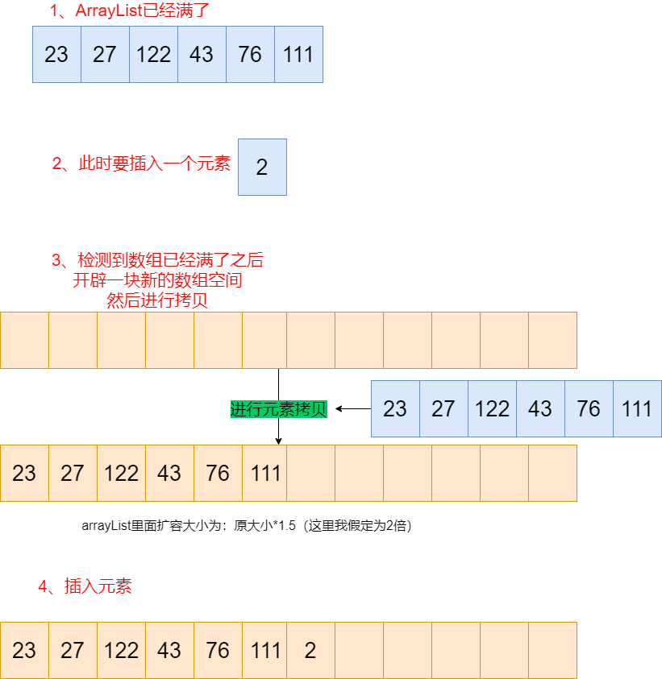
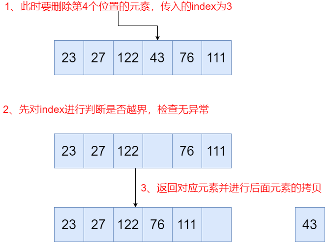

[TOC]

# 一文直接带你吃透  ArrayList

> ArrayList 是日常开发中相当常见、面试也相当常考的一种 JDK 集合类，了解并熟悉、甚至能实现一个 ArrayList 对面试、提升自己编码功底大有益处。

## 一、写给小白 ArrayList 简单使用技巧

这部分是 ArrayList 的简单使用技巧，主要是介绍 ArrayList 的几个常见方法。

```java
/**
 * 编写一个ArrayList的简单实用demo
 * ArrayList 的常见方法包括：
 *		add(element):添加元素
 *		get(index):获取下标元素
 *		remove(index):移除下标对应元素
 *		set(index,element):将index处的元素修改为element
 */
public class arrayList {
    public static void main(String[] args) {
        // 创建 ArrayList 的对象
        ArrayList al = new ArrayList();
        // 添加元素
        al.add("finky");
        // 构造随机数并进行添加
        Random rnd = new Random();
        for (int i = 0; i < 20; i++) {
            al.add(rnd.nextInt(1000));
        }
        // 取出ArrayList里的元素进行打印
        for (int i = 0; i < al.size(); i++) {
            System.out.print(al.get(i) + "  ");
        }
        // 修改0号index成的元素为doocs
        System.out.println();
        al.set(0, "doocs");
        System.out.println(al.get(0));
        // 移除“doocs”元素
        al.remove(0);
        System.out.println(al.get(0));
    }
}
```

```java
// 这是上面打印后的demo，可以看到第0处下标元素先是修改成了doocs，进行移除后，第0处下标元素变成了912
finky  912  922  284  305  675  565  159  109  73  298  491  920  296  397  358  145  610  190  839  845  
doocs
912
```


## 二、ArrayList 的源码分析

我们来看看 ArrayList 的源码：

#### 1、来看看ArrayList的初始化：

```java
// ArrayList 初始化时默认大小为10
private static final int DEFAULT_CAPACITY = 10;

// 直接初始化的话一个空数组
private static final Object[] EMPTY_ELEMENTDATA = {};

// 初始化ArrayList,传入初始化时的大小
public ArrayList(int initialCapacity) {
        if (initialCapacity > 0) {
            this.elementData = new Object[initialCapacity];
        } else if (initialCapacity == 0) {
            this.elementData = EMPTY_ELEMENTDATA;
        } else {
            throw new IllegalArgumentException("Illegal Capacity: "+
                                               initialCapacity);
        }
    }
// 如果不传入大小的话就默认大小是10，那么这里就有一个问题：我们上面插入的元素超过了10，继续插入元素就会进行拷贝扩容，性能不是特别高。所以我们一般情况下初始化时给定一个比较靠谱的数组大小，避免到时候导致元素不断拷贝
public ArrayList() {
        this.elementData = DEFAULTCAPACITY_EMPTY_ELEMENTDATA;
   }

```

==总结一下 ArrayList 初始化：我们创建 ArrayList 对象时，如果没有传入对应的大小，就会默认创建一个元素大小为10的数组，下次插入元素超过10时，会进行数组的拷贝扩容，这样性能消耗太高，所以建议就是在初始化时给定一个不要太小的容量大小。==

#### 2、 ArrayList 的 add 方法：

先上`add` 方法的代码：

```java
public boolean add(E e) {
        ensureCapacityInternal(size + 1);  // Increments modCount!!
        elementData[size++] = e;
        return true;
    }

public void add(int index, E element) {
        rangeCheckForAdd(index);
        ensureCapacityInternal(size + 1);  // Increments modCount!!
        System.arraycopy(elementData, index, elementData, index + 1,
                         size - index);
        elementData[index] = element;
        size++;
    }

public void add(E e) {
            checkForComodification();
            try {
                int i = cursor;
                ArrayList.this.add(i, e);
                cursor = i + 1;
                lastRet = -1;
                expectedModCount = modCount;
            } catch (IndexOutOfBoundsException ex) {
                throw new ConcurrentModificationException();
            }
        }

private void rangeCheck(int index) {
    if (index < 0 || index >= this.size)
           throw new IndexOutOfBoundsException(outOfBoundsMsg(index));
       }
```



先判断当前数组元素是否满了，如果塞满了就会进行数组扩容，随后进行数组拷贝。

再然后插入元素，同时对应的 index++。


#### 3、瞧瞧 ArrayList 的 set 方法：

```java
public E set(int index, E element) {
        rangeCheck(index);
        E oldValue = elementData(index);
        elementData[index] = element;
        return oldValue;
    }
 
public void set(E e) {
            if (lastRet < 0)
                throw new IllegalStateException();
            checkForComodification();

            try {
                ArrayList.this.set(lastRet, e);
            } catch (IndexOutOfBoundsException ex) {
                throw new ConcurrentModificationException();
            }
        }
```

1、先进行index判断是否越界，如果没有越界的话获取原来的旧的值

2、进行替换并返回该位置原来的旧的值

#### 4、ArrayList 的 get 方法：

```java
public E get(int index) {
            rangeCheck(index);
            checkForComodification();
            return ArrayList.this.elementData(offset + index);
        } 
```

进行index是否越界的判断，然后去取对应下标的值。

#### 5、ArrayList 的 remove 方法：

```java
public void remove() {
            if (lastRet < 0)
                throw new IllegalStateException();
            checkForComodification();

            try {
                ArrayList.this.remove(lastRet);
                cursor = lastRet;
                lastRet = -1;
                expectedModCount = modCount;
            } catch (IndexOutOfBoundsException ex) {
                throw new ConcurrentModificationException();
            }
        }
        
public E remove(int index) {
    	// 进行index是否越界的判断
            rangeCheck(index); 
            checkForComodification();
            E result = parent.remove(parentOffset + index);
            this.modCount = parent.modCount;
            this.size--;
            return result;
        }

public E remove(int index) {
        rangeCheck(index);
        modCount++;
        E oldValue = elementData(index);
        int numMoved = size - index - 1;
        if (numMoved > 0)
            System.arraycopy(elementData, index+1, elementData, index,
                             numMoved);
        elementData[--size] = null; 
        return oldValue;
    }
```



1、先进行下标是否越界的判断，获取index处的元素值（这是要删除的值）

2、然后进行元素拷贝，把index后面的元素往前拷贝


#### 6、关于 ArrayList 动态扩容和数组拷贝：

```java
private void ensureCapacityInternal(int minCapacity) {
        ensureExplicitCapacity(calculateCapacity(elementData, minCapacity));
    }

private void ensureExplicitCapacity(int minCapacity) {
    modCount++;
    if (minCapacity - elementData.length > 0)
        grow(minCapacity);
}

private void grow(int minCapacity) {
        // overflow-conscious code
        int oldCapacity = elementData.length;
       // 扩容的代码：这里做了位运算，相当于数组扩容了1.5倍
        int newCapacity = oldCapacity + (oldCapacity >> 1);
        if (newCapacity - minCapacity < 0)
            newCapacity = minCapacity;
        if (newCapacity - MAX_ARRAY_SIZE > 0)
            newCapacity = hugeCapacity(minCapacity);
        // 随后进行元素拷贝
        elementData = Arrays.copyOf(elementData, newCapacity);
    }

```

现在假定场景：arraylist中已经有10个元素类，要放第11个元素。

此时进行容量检测，出现问题：空间大小不够。

解决方法：此时进行数组扩容右位移1（**相当于总容量多加1.5倍**）扩容，老的大小+老大小的一半，进行元素拷贝

## 三、来仿照 JDK 源码写一个自己的 ArrayList 把

```java
public class OwnArrayList<E> {
    private E data[];
    private int size;

    public OwnArrayList(int capacity) {
        data = (E[]) new Object[capacity];
        size = 0;
    }
	//   初始化是默认设置大小为20
    public OwnArrayList() {
        this(20);
    }

    //    获取数组容量
    public int getCapacity() {
        return data.length;
    }

    //    获取数组元素个数
    public int getSize() {
        return size;
    }

    //    判断数组是否为空
    public boolean isEmpity() {
        return size == 0;
    }

    // 获取index索引位置的元素
    public E get(int index) {
        if (index < 0 || index >= size)
            throw new IllegalArgumentException("add failed,the index should >= 0 or <= size");
        return data[index];
    }

    // 修改index索引位置的元素为e
    public void set(int index, E e) {
        if (index < 0 || index >= size)
            throw new IllegalArgumentException("add failed,the index should >= 0 or <= size");
        data[index] = e;
    }
    
    //    在数组中间插入一个元素
    public void add(int index, E element) {
        if (size == data.length) {
            throw new IllegalArgumentException("AddLast failed,array has already full");
        }
        if (index < 0 || index > size) {
            throw new IllegalArgumentException("add failed,the index should >= 0 or <= size");
        }
        for (int i = size - 1; i >= index; i--) {
            data[i + 1] = data[i];
        }
        data[index] = element;
        size++;
    }

    //    向数组元素末尾添加一个元素
    public void addLast(E element) {
        add(size,element);
    }
    
    //    在数组头部插入一个元素
    public void addFirst(E element) {
        add(0, element);
    }

    // 判断是否含有元素
    public boolean contains(E e) {
        for (int i = 0; i < size; i++)
            if (data[i] == e)
                return true;
        return false;
    }

    // 查找元素e的位置
    public int find(E e) {
        for (int i = 0; i < size; i++) {
            if (data[i] == e) {
                return i;
            }
        }
        return -1;
    }

    // 删除index位置的元素
    public E remove(int index) {
        if (index < 0 || index > size) {
            throw new IllegalArgumentException("index should be 0 to size");
        }
        E remove_element = data[index];
        for (int i = index + 1; i < size; i++) {
            data[i - 1] = data[i];
        }
        size--;
        return remove_element;
    }

    // 删除末尾元素
    // 注意：这是逻辑删除，但是size的大小已经做了相应的减少，所以从实际意义上我们外界并不能访问到末尾元素的值
    public E removelast() {
        return remove(size - 1);
    }

    // 删除开头元素
    public E removeFirst() {
        return remove(0);
    }
    
    // 将数组空间的容量变成newCapacity大小
    private void resize(int newCapacity) {
        newCapacity = getCapacity()*2;
        E[] newData = (E[]) new Object[newCapacity];
        for (int i = 0; i < size; i++)
            newData[i] = data[i];
        data = newData;
    }
```


## 四、面试时关于 ArrayList 要说的事

如果有人问你 ArrayList 知多少，我觉得可以从这几个方面出发：

ArrayList 的底层是基于数组进行的，进行随机位置的插入和删除、以及扩容时性能很差，但进行随机的读和取时速度却很快。

接着可以从源码的角度分析 add、remove、set、get、数组扩容拷贝的过程场景。

最后也是特别重要的一点，就是要积极掌握主动性，延伸出 LinkedList的特点、源码、两者间的对比等。


注：当需要动态数组时我们通常使用 ArrayList 而不是使用类似的 vector，这里有一点说明一下，就是尽管Vector的方法都是线程安全的，但其在单线程下需要花费的时间更多，而ArrayList尽管不是线程安全的，但其花费的时间很少。

## 终：参考资料

1. JDK 集合框架 ArrayList 源码
2. 《Core.Java.Volume.I.Fundamentals.11th.Edition》

